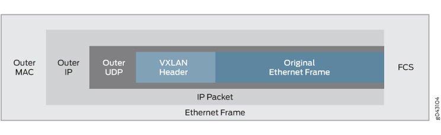
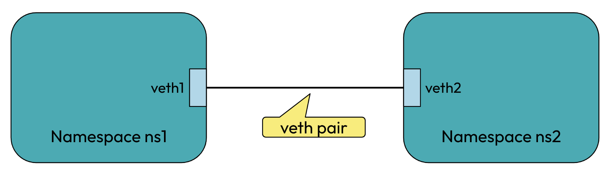

# Core-Networking-Concepts

## Index
1. [TUN](#tun)
2. [TAP](#tap)
3. [Overlays](#overlays)
4. [VXLAN](#vxlan)
5. [Open vSwitch](#Open_vSwitch_(OVS))
6. [CNI](#cni)
7. [Flannel](#flannel)
8. [Cilium](#cilium)
9. [Packet Copy](#pc)
10. [Zero Copy](#zc)
11. [Libvirt](#libvirt)
10. [Summary Table](#st)
11. [Linux Bridge](#lb)
10. [VETH Pair](#vp)


## TUN
- TUN refers to a virtual network kernel device that operates at the network layer (Layer 3 of the OSI model). 
- It handles IP packets and provide point-to-point connection for user-space programs to send and receive raw IP packets, making them suitable for routing

**Application** <br> 
1. **VPNs** : It is widely used in VPN solutions by enabling the routing of IP packets through secure, encrypted tunnels between servers and clients. <br> Eg: OpenVPN, WireGuard

2. **Virtual Networks for Containers and VMs**: Virtual machines and containers use TUN interfaces to create isolated virtual networks within hosts, allowing internal IP-based communication that is independent of the physical network interface.<br>​ Eg: Virtual Box, QEMU/KVM

## TAP
- TAP devices operate at Layer 2 (Ethernet/data link layer), handling raw Ethernet frames, including MAC addresses and VLAN tags

- They acts like ethernet card in software and can be linked to a network bridge. This lets different network devices (like virtual machines or containers) communicate as if they are physically connected

```ethernet frame``` - An ethernet frame is a structured packet of data used in wired networks to carry information between devices. 

**Application** <br>
- Used in virtualization platforms and VPN software to bridge ethernet traffic, allowing user space programs or VM guests to exchange packets

## Overlays
- Overlays in a network are virtual or logical networks built on top of an existing physical network (underlay) using technologies like tunneling 
- They create separate paths/networks that can carry traffic independently of the underlying hardware, enabling features like secure **VPNs**, scalable **multi-tenant cloud networking**, and **network virtualization** in data centers. 
- Eg: Technologies like VXLAN, GRE, and SD-WAN are common examples of overlay networks used in modern enterprise and cloud infrastructure.​

## VXLAN
- VXLAN (Virtual Extensible LAN) is a network virtualization protocol that allows virtual Layer 2 (Ethernet) networks to be built over existing Layer 3 (IP) networks using encapsulation.

```encapsulation``` - Encapsulation in VXLAN means wrapping a regular Ethernet frame (Layer 2) inside a series of headers so the frame can be transmitted across existing IP networks (Layer 3)



<a id="Open_vSwitch_(OVS)"></a>
## Open vSwitch (OVS)
<!-- Linked from Index item 5 -->
- Open vSwitch (OVS) is an open-source software switch designed to provide network connectivity between virtual machines and containers. 
- It acts as a physical network switch, supporting advanced features like VLANs, network automation, traffic monitoring, and tunneling protocols (including VXLAN and GRE).

**Application** <br>
OVS is widely used in cloud data centers and software-defined networking (SDN) to manage and automate virtual network infrastructure.

<a id="cni"></a>
## Cloud Native Interface (CNI)

- CNI is a standard way for connecting containers and services inside cloud platoforms like Kubernetes clusters using flexible, software-driven networking. 

- CNI plugins (like Flannel, Calico, or Cilium) provide the actual networking—giving containers IP addresses and routing traffic between them in modern cloud environments.

## FLannel
Flannel is an open-source networking solution for Kubernetes and other container platforms that creates an overlay network, allowing containers running on different servers (nodes) to communicate as if they were on the same local network.

## Cilium
Cilium is a CNI plugin built on eBPF technology in the Linux kernel that provides high-performance connectivity, security, and visibility for workloads running in Kubernetes and cloud-native environments

```eBPF``` - (extended Berkeley Packet Filter) is a Linux kernel technology that allows small, secure, sandboxed programs to run inside the kernel without modifying kernel source code or adding kernel modules.

<a id="pc"></a>
## Packet Copy
- Packet copy is the process of making duplicate copies of data packets as it passes through network devices, such as switch, router etc.
- Copied packets is sent to another location for monitoring, logging, intrusion detection or traffic analysis without interrupting the flow of original data

<a id="zc"></a>
## Zero Copy
- Zero copy is a technique that allows data to be transferred between hardware devices and application memory without the CPU having to manually copy the data between user space and kernel space. 
- Instead, the OS uses mechanisms like direct memory access (DMA) or memory mapping to let data move directly between source and destination

**Importance**
1. It greatly reduces CPU usage as it doesn't waste cycles for copying data
2. Lowers latency and increases throughput
3. Reduces context switches between user space and kernel space, making the system more efficient.

**Application** <br>
Zero copy is especially valuable in high-performance networking, cloud services, streaming, and large-scale data processing where moving large amounts of data efficiently is essential.

## Libvirt
Libvirt is an open-source toolkit and API designed to manage virtual machines (VMs), networks, and storage across different virtualization platforms and hypervisors, such as KVM/QEMU, Xen, and others.

**Function**
1. It offers a unified way to create, start, stop, migrate, and configure VMs
2. Handles networking, storage, and device management for both local and remote hosts
3. Libvirt provides both command-line ``virsh`` and graphical interfaces ``virt-manager``, making it popular for automating and simplifying VM management on Linux

<a id="st"></a>
## Summary Table

| Concept           | Definition/Description                                                                 | Layer/Type           | Example Applications/Tools                                    | Notes & Features                               |
|-------------------|---------------------------------------------------------------------------------------|----------------------|---------------------------------------------------------------|------------------------------------------------|
| **TUN**           | Virtual network device that handles IP packets, provides point-to-point routing | Layer 3 (Network)    | VPNs (OpenVPN, WireGuard), VMs/Containers (VirtualBox, QEMU)  | Used for routing; does not handle Ethernet frames |
| **TAP**           | Virtual device that handles raw Ethernet frames, supports bridging             | Layer 2 (Ethernet)   | VM network bridging (KVM, VirtualBox), VPN bridging           | Simulates Ethernet cards, connects to bridges    |
| **Overlay**       | Logical/virtual networks built over physical networks using tunneling                  | Virtual, Multi-layer | VXLAN, GRE, SD-WAN                                            | Enables cloud, multi-tenant networking           |
| **VXLAN**         | Protocol for Layer 2 networks over Layer 3 via encapsulation                          | Overlay Technology   | Data centers, cloud fabrics                                   | Supports encapsulation of Ethernet frames        |
| **Open vSwitch**  | Software switch for connecting VMs/containers, supports advanced networking            | Layer 2/3 Software   | SDN, cloud automation, OVS bridges                            | VLAN, VXLAN, GRE supported, monitoring           |
| **CNI**           | Standard for container networking (Kubernetes), manages IPs, routing, services         | API/Plugin Level     | Flannel, Calico, Cilium                                      | Modular networking architecture                  |
| **Flannel**       | Open source CNI plugin for container overlay networks                                  | CNI/Overlay          | Kubernetes overlay networks                                  | Assigns subnet per host, supports VXLAN          |
| **Cilium**        | eBPF-based CNI plugin, provides robust security and visibility for containers          | CNI/eBPF             | Kubernetes advanced networking, L7 protocol filtering         | Observability via Hubble, load-balancing         |
| **eBPF**          | Kernel technology for safe, in-kernel programmable data processing                     | Kernel Extension     | Network observability, security, tracing                      | Sandboxed programs, highly flexible              |
| **Packet Copy**   | Making duplicate packets for monitoring/analysis, without affecting source flow        | Networking Process   | IDS, traffic logging, intrusion detection                     | Enables live, safe traffic inspection            |
| **Zero Copy**     | Data transferred directly without manual CPU copying between buffers                   | Memory/IO Optimization | High-performance networking, streaming, cloud services      | Minimizes CPU use, boosts throughput             |
| **Libvirt**       | Toolkit & API for managing VMs, networks, storage across platforms                     | Management API       | KVM/QEMU, Xen, virt-manager, virsh                            | Unifies VM creation, migration, config           |

<a id="lb"></a>
## Linux Bridge
- A Linux bridge is a kernel-based virtual device that acts like a Layer 2 network switch, forwarding packets between two or more network interfaces based on MAC addresses. 
- It is commonly used to connect virtual machines or containers to a physical network, allowing them to communicate as if they were directly attached to a real network switch.

<a id="vp"></a>
## VETH Pair
- A veth pair (virtual Ethernet pair) is a pair of interconnected virtual network interfaces that work like a virtual Ethernet cable. 

**Working** <br>
When you send a packet into one end of the pair, it instantly appears at the other end, allowing for seamless communication between network namespaces, containers, or bridges.

**Application** <br>
Used to link Linux bridges, Open vSwitch, containers (Docker, Kubernetes), and different network namespaces together.

